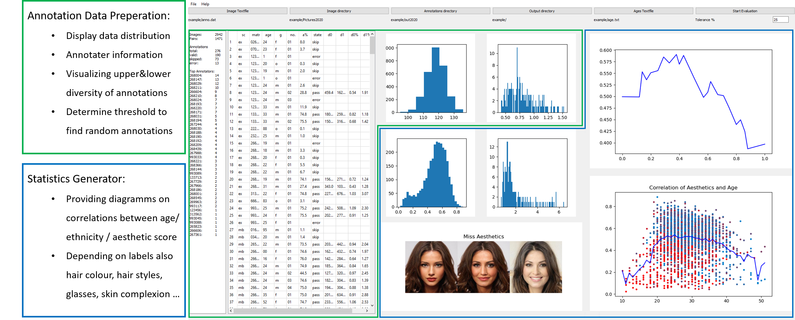
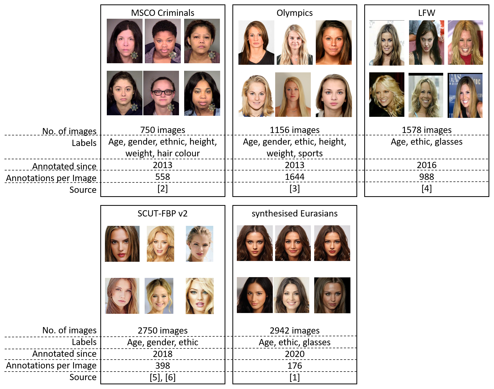

# AestheticFacesToolbox
Toolbox to analyse social and ethical aspects on aesthetics of faces

## Abstract
This Github-Repository contains a toolbox to analyse and administrate datasets of annotated images of 
faces whithin different ethnicities. With its modules
* Preparation of the annotated datasets
* statistics generator
* dataset administration
* pretrained CNN hair and skin complexion estimator
* pretrained CNN Ethnicity Estimator
* pretrained CNN Aesthetics Score Estimator
the toolbox provides tools to analyse and visualize the essential information about given data and its annotation process.
 
Secondly this Githup-Repository provides an extensive dataset of 9934 images from persons of different ethnicities 
with individual social backgrounds. These images are labeled and already annotated in 8 years of surveys with a total number 
of 5,49 Million annotations. Parts of the annotated images are generated with the StarGAN v.2 \(developed of Choi et al \[1\]\) 
to determine the influence of the biased view of annotators on aesthetics of persons from different ethnicities.

Additionaly to this README the paper cited below gives detailed information about the toolbox and the dataset.  	

## Toolbox


#### Dataset Administration

* Browsing dataset
* Generating new GAN images
* adding missing labels with machine learning tools

#### CNN Hair and Skin Complexion Estimator
* Hair colour and hair style detection 
* Skin complexion analysis with texture extraction and evaluation
* Adding labels in your dataset
	
#### CNN Ethnicity Estimator
* modified deep network pretrained on 200M images and 8M identities
* retrained for ethnicity estimation with nestrov momentum
* 95% accuracy on validation set
	
#### CNN Aesthetics Score Estimator
* CNN trained on annotated aesthetic scores (collected in 8 years of surveys)
* bias reduction due to including detected correlations of ethnicity and skin complexion
	
## Dataset


You can request the full dataset including its annotations via Mail from: 
* Prof. Dr. rer. nat. Matthias Rätsch: [matthias.raetsch@reutlingen-university.de](matthias.raetsch@reutlingen-university.de/)
* Michael Danner: [michael.danner@reutlingen-university.de](michael.danner@reutlingen-university.de/)

## Requirements:
Tested with Python 3.6, matplotlib==3.2.2, numpy==1.19.0, Pillow==7.1.2, PyQt5==5.15.0

## Citation
[Who Loves Virtue as much as He Loves Beauty?: Deep Learning based Estimator for Aesthetics of Portraits](https://www.scitepress.org/Link.aspx?doi=10.5220/0009172905210528)
```
@conference{visapp20,
author={Tobias Gerlach. and Michael Danner. and Le Ping Peng. and Aidas Kaminickas. and Wu Fei. and Matthias Rätsch.},
title={Who Loves Virtue as much as He Loves Beauty?: Deep Learning based Estimator for Aesthetics of Portraits},
booktitle={Proceedings of the 15th International Joint Conference on Computer Vision, Imaging and Computer Graphics Theory and Applications - Volume 5: VISAPP,},
year={2020},
pages={521-528},
publisher={SciTePress},
organization={INSTICC},
doi={10.5220/0009172905210528},
isbn={978-989-758-402-2},
}
```

## Sources
[1]:	Choi, Y., Choi, M., Kim, M., Ha, J., Kim, S., Choo, J.: Stargan: Unified generative adversarial networks for multi-domain image-to-image translation. CoRR abs/1711.09020 (2017), (http://arxiv.org/abs/1711.09020/)

[2]:	Hülsmann, R.: MCSO Online Inmate Data (2013), (https://www.mcso.us/PAID/Home/SearchResults/)

[3]:	Hülsmann, R., Braun, S.: Olympic Photos, Galleries and Slideshows. https://www.olympic.org/photos (Retrieved 03/08/2013)

[4]:	Huang, G.B., Mattar, M., Berg, T., Learned-Miller, E.: Labeled faces in the wild: A database forstudying face recognition in unconstrained environments (2008)

[5]:	Xie, D., Liang, L., Jin, L., Xu, J., Li, M.: SCUT-FBP: A benchmark dataset for facial beauty perception. In: 2015 IEEE International Conference on Systems, Man, and Cybernetics, Kowloon Tong, Hong Kong, October 9-12, 2015. pp. 1821–1826. IEEE (2015), https://doi.org/10.1109/SMC.2015.319

[6]:	Liang, L., Lin, L., Jin, L., Xie, D., Li, M.: Scut-fbp5500: a diverse benchmark dataset for multi-paradigm facial beauty prediction. In: 2018 24th International Conference on Pattern Recognition (ICPR). pp. 1598–1603. IEEE (2018)

